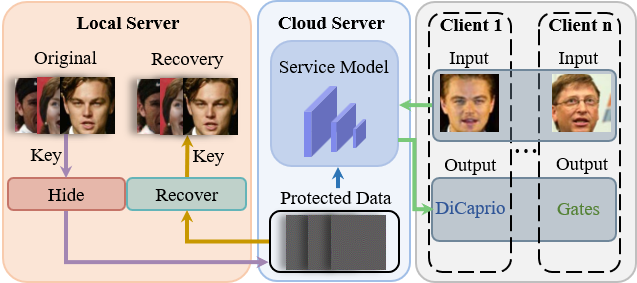
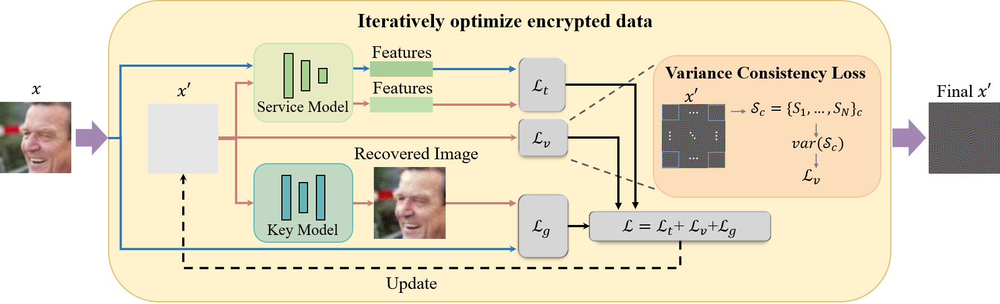

<div align="center">   
  
# Hiding Visual Information via Obfuscating Adversarial Perturbations
[](https://openaccess.thecvf.com/content/ICCV2023/papers/Su_Hiding_Visual_Information_via_Obfuscating_Adversarial_Perturbations_ICCV_2023_paper.pdf)

</div>

This repository is an official implementation of [Visual Information Hiding Based on Obfuscating Adversarial Perturbations](https://openaccess.thecvf.com/content/ICCV2023/papers/Su_Hiding_Visual_Information_via_Obfuscating_Adversarial_Perturbations_ICCV_2023_paper.pdf) (ICCV 2023).


Growing leakage and misuse of visual information raise security and privacy concerns, which promotes the development of information protection. Existing adversarial perturbations-based methods mainly focus on the deidentification against deep learning models. However, the inherent visual information of the data has not been well protected. In this work, inspired by the Type-I adversarial attack, we propose an Adversarial Visual Information Hiding (AVIH) method to protect the visual privacy of data. Specifically, the method generates obfuscating adversarial perturbations to obscure the visual information of the data. Meanwhile, it maintains the hidden objectives to be correctly predicted by models. In addition, our method does not modify the parameters of the applied model, which makes it flexible for different scenarios. Experimental results on the recognition and classification tasks demonstrate that the proposed method can effectively hide visual information and hardly affect the performances of models


<p float="left" align="center">
 
<figcaption align="center">
  
The illustration of visual information hiding for face recognition systems in cloud environments. The gallery set is protected and provided to the DNN in the cloud. Protected image has quite different visual information from the original image, but it is still correctly identified. The protected gallery set can be recovered by a key model by the owner.
</figcaption>
</p>


<p float="left" align="center">
 
<figcaption align="center">
  
The overview of adversarial attack-based visual information hiding (AVIH) method. Taking the face recognition as an example, given a service model and a pre-trained key model, we protect the original image $x$ and obtain the protected image $x^{\prime}$.
</figcaption>
</p>


## Requirements
- This codebase is written for `python3` and 'pytorch'.
- To install necessary python packages, run `pip install -r requirements.txt`.


## Experiments
### Data && Preparation
1. Please download and place all datasets into the data directory.
2. Align and crop the face image to $112 \times 112$ and put it under `data/align`.
3. Put the pre-trained generative model (key model) under the `checkpoints`. We provide a [pre-trained model](https://drive.google.com/drive/folders/1ogIV18DxHNYlnuF4N4dQF-Ft00QwG2ov?usp=sharing) for testing in face recognition tasks.


### Image Encryption for Face Recognition
Running command to encrypt the image:

```python
python main.py --model pix2pix --task face_recognition
```


### Image Encryption for Classification
Running command to encrypt the image:

```python
python main.py --model pix2pix --task classification --src_model Resnet18 --batch_size 10 --root ./data/cif
```


## License and Contributing
- This README is formatted based on [paperswithcode](https://github.com/paperswithcode/releasing-research-code).
- Feel free to post issues via Github.


## Acknowledgements
This code is built on [CycleGAN](https://github.com/junyanz/pytorch-CycleGAN-and-pix2pix), [TIP-IM](https://github.com/ShawnXYang/TIP-IM) and [MS-SSIM](https://github.com/VainF/pytorch-msssim/tree/master). We thank the authors for sharing the codes.


## Reference
If you find the code useful in your research, please consider citing our paper:


<pre>
@InProceedings{Su_2023_ICCV,
    author    = {Su, Zhigang and Zhou, Dawei and Wang, Nannan and Liu, Decheng and Wang, Zhen and Gao, Xinbo},
    title     = {Hiding Visual Information via Obfuscating Adversarial Perturbations},
    booktitle = {Proceedings of the IEEE/CVF International Conference on Computer Vision (ICCV)},
    month     = {October},
    year      = {2023},
    pages     = {4356-4366}
}
</pre>
